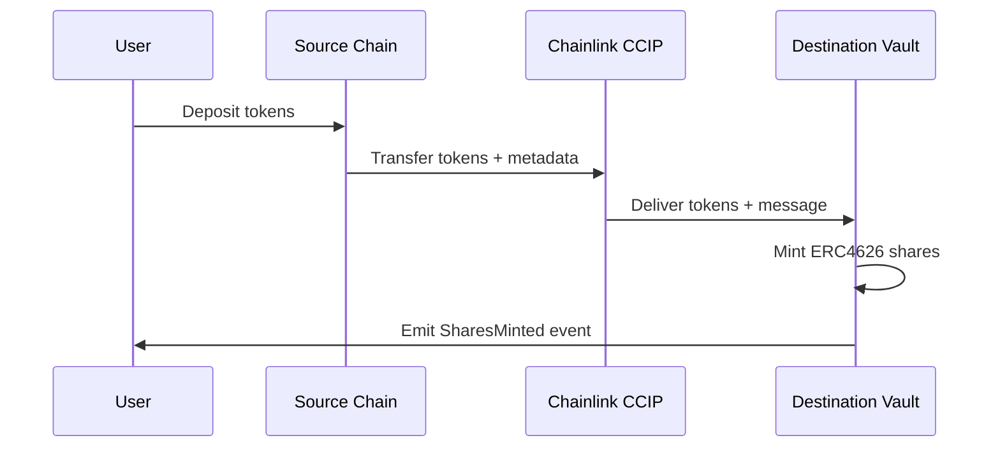

# Vault Architecture Analysis: Adapting for Multi-Chain DeFi Yield Optimizer

## Executive Summary

Based on analysis of Pika Protocol's vault implementation and cross-chain ERC4626 patterns, this report provides a comprehensive architectural blueprint for building a multi-chain DeFi yield optimizer that supports deposits from any chain with automatic routing to highest yield strategies.

## 1. Vault Contract Structure and Inheritance Patterns

### 1.1 Pika Protocol Vault Architecture

**Core Components:**
- **Custom Vault Implementation**: Pika uses a proprietary vault design rather than standard ERC4626
- **Share-based System**: Users stake tokens and receive shares proportional to their contribution
- **Utilization Management**: Dynamic exposure limits based on vault utilization
- **Time-locked Staking**: Minimum 3-day lock-up period for liquidity providers

**Key Functions:**
```solidity
// Core vault operations
function stake(uint256 amount) external;
function redeem(uint256 shares) external;
function getShare(address user) external view returns (uint256);
function getVault() external view returns (VaultInfo);
```

**Inheritance Pattern:**
```
BaseContract
├── ReentrancyGuard (security)
├── AccessControl (roles: owner, guardian, gov)
└── PausableTrading (emergency controls)
```

### 1.2 ERC4626 Standard Implementation

**Standard Interface Benefits:**
- Standardized deposit/withdraw mechanisms
- Share-based accounting with automatic yield distribution
- Interoperability across DeFi protocols
- Composability with other yield strategies

**Core ERC4626 Functions:**
```solidity
function deposit(uint256 assets, address receiver) external returns (uint256 shares);
function withdraw(uint256 assets, address receiver, address owner) external returns (uint256 shares);
function redeem(uint256 shares, address receiver, address owner) external returns (uint256 assets);
function previewDeposit(uint256 assets) external view returns (uint256 shares);
```

## 2. Cross-Chain Deposit/Withdrawal Mechanisms

### 2.1 Chainlink CCIP Implementation

**Architecture Pattern:**
- **Source Chain Contract**: Handles initial deposits and CCIP message initiation
- **Destination Chain Vault**: Receives tokens and mints shares via ERC4626
- **Bidirectional Flow**: Supports both deposit and withdrawal across chains

**Cross-Chain Workflow:**


### 2.2 Message Passing Structure

**Cross-Chain Message Format:**
```solidity
struct CrossChainDepositMessage {
    address user;
    uint256 amount;
    address sourceToken;
    uint256 sourceChainId;
    bytes strategyData;
}
```

## 3. Yield Strategy Integration Patterns

### 3.1 Pika Protocol Revenue Model

**Revenue Sources:**
- Trading fees (50% to vault, 50% to protocol)
- Funding payments from perpetual positions
- Liquidation profits
- Exposure-based yield from market making

**Risk Management:**
- Maximum exposure limits per trading pair
- Dynamic utilization multipliers
- Position size restrictions based on vault capacity

### 3.2 Multi-Strategy Yield Optimization

**Strategy Router Pattern:**
```solidity
interface IYieldStrategy {
    function deposit(uint256 amount) external returns (uint256 shares);
    function withdraw(uint256 shares) external returns (uint256 amount);
    function getAPY() external view returns (uint256);
    function getTotalAssets() external view returns (uint256);
}
```

**Yield Comparison Logic:**
- Real-time APY monitoring across strategies
- Gas cost optimization for strategy switches
- Slippage protection during rebalancing
- Emergency withdrawal capabilities

## 4. Security Measures and Access Controls

### 4.1 Multi-Layer Security Architecture

**Access Control Hierarchy:**
```solidity
contract SecurityLayer {
    address public owner;        // Full administrative control
    address public guardian;     // Emergency pause capabilities
    address public governance;   // Protocol parameter updates
    
    modifier onlyAuthorized() {
        require(hasRole(msg.sender), "Unauthorized");
        _;
    }
}
```

**Security Features:**
- **ReentrancyGuard**: Prevents recursive call attacks
- **Pausable Trading**: Emergency stop mechanism
- **Timelock Contracts**: Delayed execution for critical changes
- **Multi-signature Wallets**: Distributed key management

### 4.2 Cross-Chain Security Considerations

**Message Validation:**
- CCIP message authenticity verification
- Source chain validation
- Replay attack prevention
- Rate limiting for large transfers

**Asset Security:**
- Trusted bridge validation
- Slippage protection during cross-chain transfers
- Emergency circuit breakers
- Insurance fund integration

## 5. Asset Management and Conversion Logic

### 5.1 Dynamic Asset Allocation

**Allocation Strategy:**
```solidity
struct AllocationTarget {
    address strategy;
    uint256 targetPercentage;
    uint256 currentPercentage;
    uint256 lastRebalance;
}
```

**Rebalancing Triggers:**
- Threshold-based rebalancing (e.g., 5% deviation)
- Time-based rebalancing (daily/weekly)
- APY differential rebalancing (automatic yield chasing)
- Emergency rebalancing (strategy risk events)

### 5.2 Cross-Chain Asset Conversion

**Token Standardization:**
- Canonical token addresses per chain
- Automated conversion through DEX aggregators
- Slippage-optimized routing
- MEV protection mechanisms

## 6. Adaptation Strategy for Multi-Chain Yield Optimizer

### 6.1 Proposed Architecture

```
┌─────────────────┐    ┌─────────────────┐    ┌─────────────────┐
│   Source Chain  │    │  CCIP Network   │    │ Destination     │
│                 │    │                 │    │ Yield Vaults    │
│  ┌───────────┐  │    │  ┌───────────┐  │    │  ┌───────────┐  │
│  │ Deposit   │──┼────┼──│ Message   │──┼────┼──│ Strategy  │  │
│  │ Router    │  │    │  │ Router    │  │    │  │ Vault     │  │
│  └───────────┘  │    │  └───────────┘  │    │  └───────────┘  │
│                 │    │                 │    │                 │
│  ┌───────────┐  │    │  ┌───────────┐  │    │  ┌───────────┐  │
│  │ Fee       │  │    │  │ Gas       │  │    │  │ Yield     │  │
│  │ Manager   │  │    │  │ Optimizer │  │    │  │ Tracker   │  │
│  └───────────┘  │    │  └───────────┘  │    │  └───────────┘  │
└─────────────────┘    └─────────────────┘    └─────────────────┘
```

### 6.2 Implementation Roadmap

**Phase 1: Foundation (Months 1-2)**
- Deploy ERC4626-compliant vaults on target chains
- Implement Chainlink CCIP integration
- Basic yield strategy integration (Aave, Compound)

**Phase 2: Enhancement (Months 3-4)**
- Multi-strategy yield optimization
- Cross-chain rebalancing mechanisms
- Advanced security features

**Phase 3: Optimization (Months 5-6)**
- Gas optimization and MEV protection
- Insurance fund integration
- Performance analytics and reporting

### 6.3 Key Technical Specifications

**Smart Contract Stack:**
```solidity
YieldOptimizerVault.sol
├── ERC4626 (standard vault interface)
├── CrossChainReceiver (CCIP integration)
├── StrategyManager (yield optimization)
├── SecurityModule (access control + reentrancy)
└── FeeManager (performance and management fees)
```

**Cross-Chain Integration:**
- **Supported Chains**: Ethereum, Polygon, Arbitrum, Optimism, Base
- **Bridge Protocol**: Chainlink CCIP (primary), Wormhole (backup)
- **Asset Standards**: ERC20 tokens with 18 decimal precision
- **Gas Optimization**: Batch operations and signature compression

### 6.4 Economic Model

**Fee Structure:**
- Management Fee: 0.5% annually
- Performance Fee: 10% on profits above benchmark
- Cross-chain Fee: 0.1% per bridge transaction
- Gas Refund: Partial gas cost absorption for small deposits

**Yield Distribution:**
- 85% to depositors (proportional to shares)
- 10% performance fee to protocol treasury
- 5% to insurance fund

## 7. Risk Assessment and Mitigation

### 7.1 Technical Risks

**Smart Contract Risk:**
- Mitigation: Comprehensive audits, formal verification, bug bounties
- Insurance: Protocol-level coverage through Nexus Mutual

**Bridge Risk:**
- Mitigation: Multi-bridge architecture, emergency pause mechanisms
- Monitoring: Real-time bridge health monitoring

**Strategy Risk:**
- Mitigation: Diversified strategy allocation, maximum exposure limits
- Response: Automated strategy blacklisting on risk events

### 7.2 Economic Risks

**Impermanent Loss:**
- Protection: IL protection mechanisms for LP strategies
- Hedging: Dynamic hedging for correlated asset exposure

**Liquidity Risk:**
- Mitigation: Liquidity buffers, emergency withdrawal reserves
- Monitoring: Real-time liquidity monitoring across strategies

## 8. Conclusion and Next Steps

The analysis reveals that adapting vault architecture for a multi-chain DeFi yield optimizer requires:

1. **Hybrid Architecture**: Combining ERC4626 standardization with custom cross-chain logic
2. **Robust Security**: Multi-layered security with emergency controls
3. **Dynamic Optimization**: Real-time yield comparison and automatic rebalancing
4. **Scalable Infrastructure**: Modular design supporting multiple chains and strategies

**Immediate Action Items:**
1. Begin ERC4626 vault development with Chainlink CCIP integration
2. Implement basic yield strategy interfaces (Aave, Compound)
3. Develop cross-chain message routing and validation
4. Create comprehensive testing framework for multi-chain scenarios

The proposed architecture leverages proven patterns from Pika Protocol while addressing the unique challenges of cross-chain yield optimization, positioning the project for scalable growth across the multi-chain DeFi ecosystem.